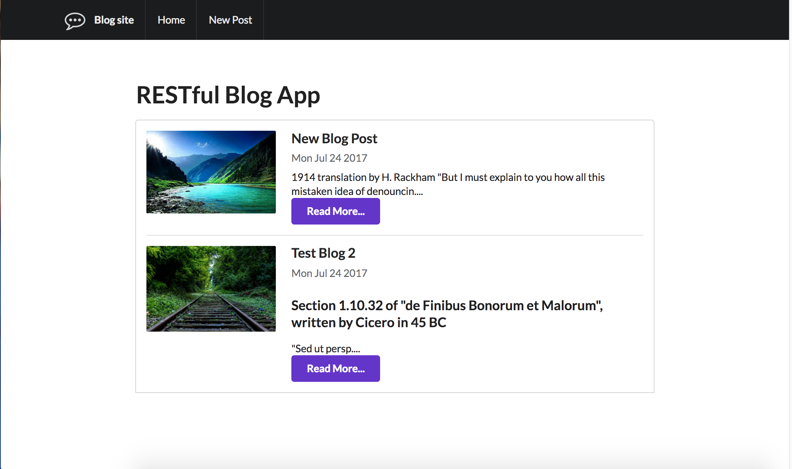
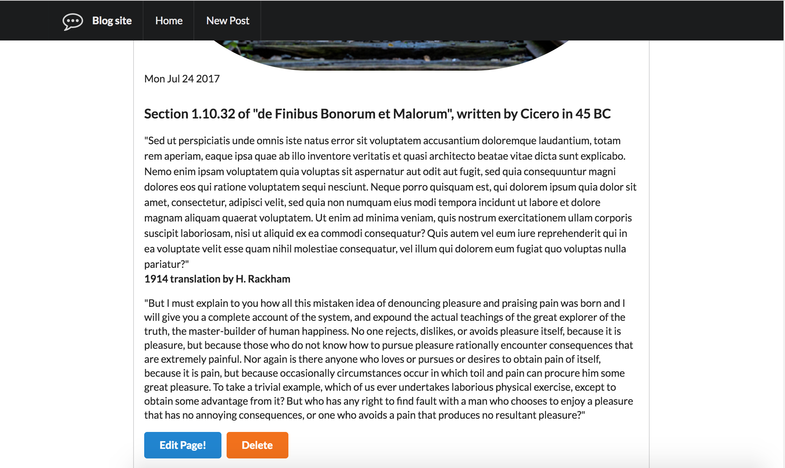
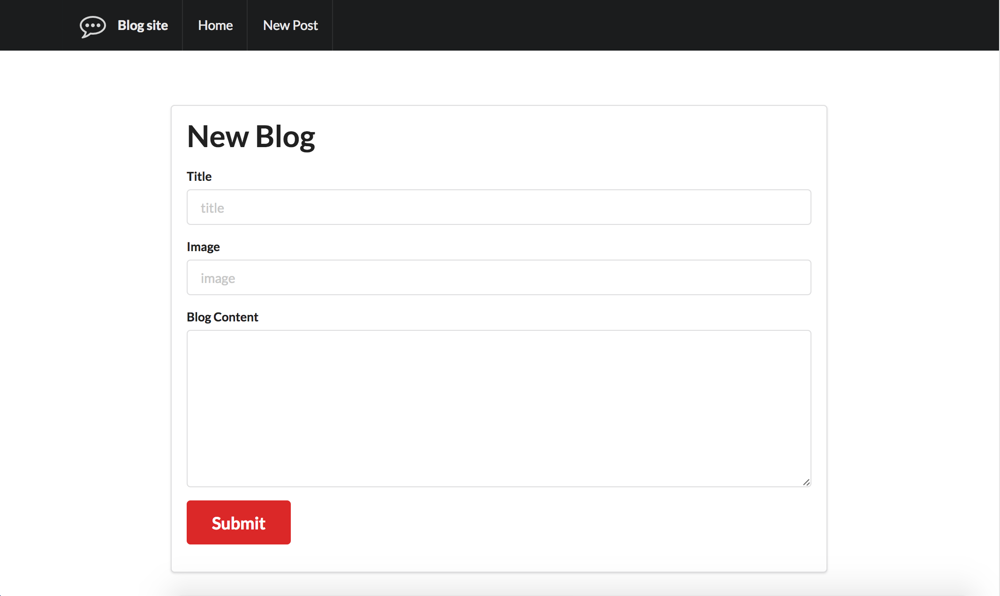
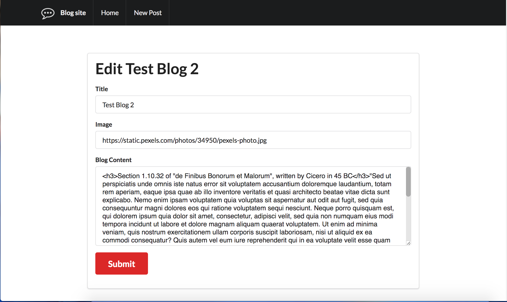

# Blog-Application
A Full stack Blog Page created using MEN stack.
* * *
## Tools used:
	- HTML5
	- CSS3
	- Express.js
	- Embedded JavaScript
	- JSON
	- MongoDB
	- Mongoose
	- RESTful Web Services
	- MethodOverriding to override the PUT and DELETE methods in HTML since HTML does not allow PUT and DELETE methods to be used in forms
* * *
### Home Page

* * *
### More Page

* * *
### Add Blog Page

* * *
### Edit Page

* * * 
